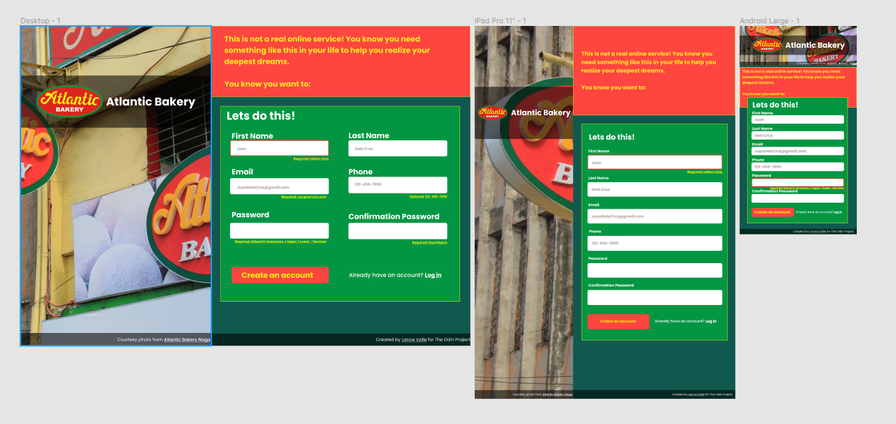

# Project-Sign-up-Form

The Odin Project :JavaScript Path 1st project (HTM and CSS Intermediate project)

created a sign up form website.

[Live Demo:] (https://lance28-beep.github.io/Project-Sign-up-Form/)

This project was created for the [Sign-Up Form assignment](https://www.theodinproject.com/paths/full-stack-javascript/courses/intermediate-html-and-css/lessons/sign-up-form) as part of [The Odin Project](https://www.theodinproject.com) curriculum. I met all the assignment objectives and then expanded on it with my own concepts to make it more functional and user-friendly.

This form uses simple HTML validation via the `pattern` attribute of the `input` element, with a little JavaScript help to make it more user-friendly. It utilizes the `:valid` and `:invalid` pseudo-elements to provide feedback to the user.

<h2>stack used<h2>
<ul>
<li>HTML</li>
<li>CSS</li>
<li>JavaScript</li>
<li>Sass</li>
<li>Media query</li>
</ul>
